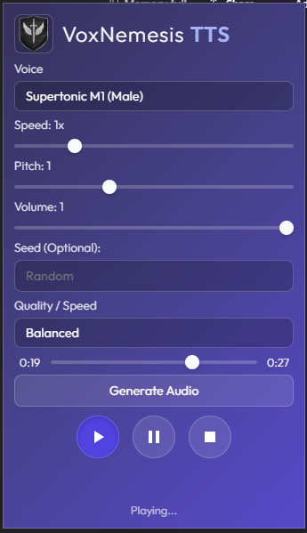

# Supertonic Performance Benchmarks

This guide captures manual benchmarks comparing GPU (WebGPU) vs CPU (WASM) execution across vendors. Use it to validate perf regressions and to document hardware deltas.

## What to measure
- Cold init time: message `init` → models ready (with first-time downloads noted separately).
- Warm init time: re-init after cache primed.
- Synthesis time: `speak` call for a fixed phrase with autoplay disabled.
- Playback latency: time from `playBuffer` request to audio start (optional).

## Test matrix
Fill one row per run (3+ iterations recommended per cell):

| Device | Browser build | Vendor/Adapter (from `navigator.gpu`) | Mode | Init ms (avg) | Speak ms (avg) | Notes |
| --- | --- | --- | --- | --- | --- | --- |
| e.g., Ryzen 7 7840U | Chrome 120 | `AMD Radeon (RDNA3)` | WebGPU | 85 | 230 | Warm cache |
| e.g., Ryzen 7 7840U | Chrome 120 | `AMD Radeon (RDNA3)` | WASM (CPU) | 140 | 410 | Warm cache |
| ... | ... | ... | ... | ... | ... | ... |

## Setup
1) Enable DevTools: right-click popup → Inspect, or use `chrome://extensions` → Inspect views → `offscreen.html`.
2) Optional: clear caches between runs for "cold" numbers:
   ```js
   caches.keys().then(keys => Promise.all(keys.map(k => caches.delete(k))));
   ```
3) Ensure one benchmark mode per run: WebGPU (`useWebGPU: true`) vs CPU (`useWebGPU: false`).
4) Visual reference: the popup controls in the extension look like:

  

## Benchmark helpers (run in DevTools console)
Use the extension messaging directly from the offscreen page console. Adjust text as needed.

```js
async function runBench({ useWebGPU = true, iterations = 3, text = 'Benchmark the Supertonic voice.' } = {}) {
  const results = [];
  for (let i = 0; i < iterations; i++) {
    const initStart = performance.now();
    await chrome.runtime.sendMessage({ target: 'offscreen', type: 'init', useWebGPU });
    const initMs = performance.now() - initStart;

    const speakStart = performance.now();
    await chrome.runtime.sendMessage({ target: 'offscreen', type: 'speak', text, settings: { autoplay: false } });
    const speakMs = performance.now() - speakStart;

    results.push({ iteration: i + 1, useWebGPU, initMs: Math.round(initMs), speakMs: Math.round(speakMs) });
  }
  console.table(results);
  const avg = results.reduce((acc, r) => ({ initMs: acc.initMs + r.initMs, speakMs: acc.speakMs + r.speakMs }), { initMs: 0, speakMs: 0 });
  avg.initMs = Math.round(avg.initMs / results.length);
  avg.speakMs = Math.round(avg.speakMs / results.length);
  console.log('Averages', { useWebGPU, ...avg });
  return results;
}

// Toggle between GPU and CPU runs:
// await runBench({ useWebGPU: true });
// await runBench({ useWebGPU: false });
```

### Capture adapter info
From the same console:
```js
navigator.gpu?.requestAdapter()?.then(adp => console.log(adp?.name || 'unknown'));
``` 
Record the adapter name in the table.

### Playback latency (optional)
If you want start-latency numbers, call `playBuffer` after a non-autoplay speak:
```js
const t0 = performance.now();
await chrome.runtime.sendMessage({ target: 'offscreen', type: 'playBuffer' });
console.log('playBuffer latency ms', Math.round(performance.now() - t0));
```

## Tips
- Run WebGPU first, then CPU, with the same text to keep Cache Storage warm; or clear caches between modes for cold comparisons.
- Note hardware concurrency (`navigator.hardwareConcurrency`) and simd status (WASM defaults to SIMD on). Threads are capped to 4 in the offscreen worker today.
- If WebGPU fails, the init path automatically retries with WASM; annotate that as a fallback case.
- Keep the machine idle during runs to reduce noise; prefer a stable power profile (plugged-in, high-performance).

## Reporting
Store filled tables (or screenshots of `console.table`) in `benchmarks/runs/<date>-<device>.md` if you want historical baselines.
